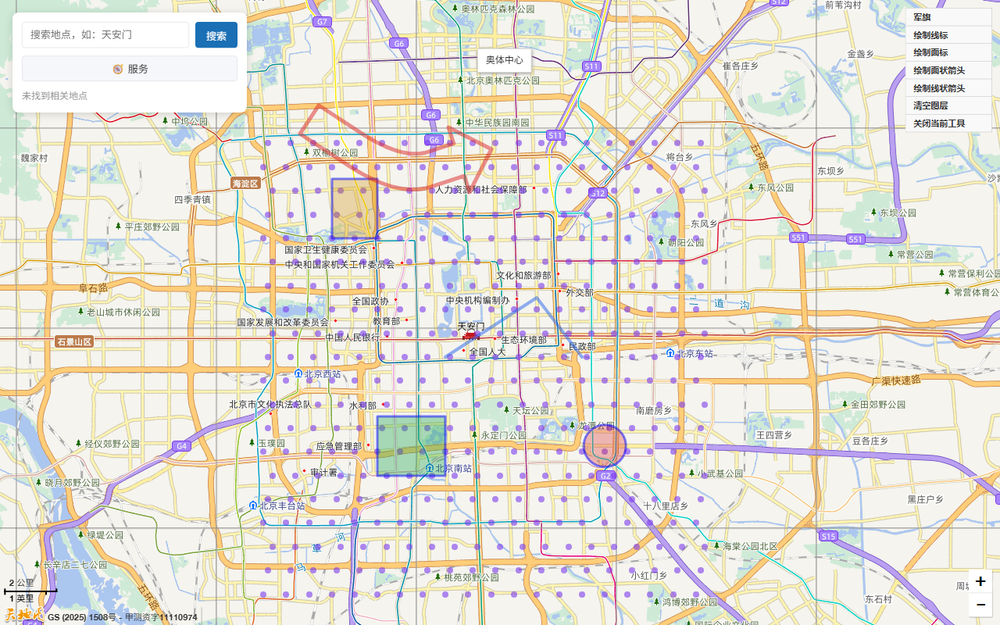

# 天地图工具库

[](https://github.com/DemoMacro/tianditu/stargazers)

[](https://www.contributor-covenant.org/version/2/1/code_of_conduct/)



> 天地图（tianditu）的 Vue 3 组件、React 组件与 Web Components 工具库。
> 同一份框架无关定义驱动多种运行时：地图、覆盖物、控件、鼠标工具、图层与标绘组件覆盖官方 JavaScript API 全部类目，props 变更经官方 setter 同步，另附独立的类型化 REST 服务客户端。第三方实现，非天地图官方产品。

## 特性

- 🗺️ **组件全覆盖** — 组件覆盖官方 JavaScript API 的每一类能力：地图、覆盖物、控件、鼠标工具、图层与服务类
- 🖥️ **多种运行时** — 同一套能力既可用 Vue 3 组件（`@tianditu/vue`）、React 组件（`@tianditu/react`），也可用 Web Components（`@tianditu/web-components`）
- 🧭 **框架无关内核** — SDK 加载器、地图会话与生命周期编排在 `@tianditu/core`，被所有适配层共享
- 🔌 **类型化 REST 客户端** — `@tianditu/services` 封装 REST 接口并带完整请求/响应类型，与地图运行时解耦
- 💪 **TypeScript 优先** — 每个包附带完整类型定义；组件 props、事件与 exposes 均在编译期检查
- 📖 **文档站** — 基于 Docus 的文档站，含实时示例；在浏览器里填入自己的密钥即可试用地图与服务

## 包

| 包                                                              | 说明                                             |
| --------------------------------------------------------------- | ------------------------------------------------ |
| [@tianditu/core](./packages/core/README.md)                     | 框架无关内核：SDK 加载器、地图会话、生命周期编排 |
| [@tianditu/vue](./packages/vue/README.md)                       | Vue 3 组件适配层                                 |
| [@tianditu/react](./packages/react/README.md)                   | React 组件适配层                                 |
| [@tianditu/web-components](./packages/web-components/README.md) | Web Components 适配层                            |
| [@tianditu/services](./packages/services/README.md)             | 类型化 REST 服务客户端（与地图运行时解耦）       |

## 快速开始

```bash
# Vue 3 组件（已包含 @tianditu/core）
$ pnpm add @tianditu/vue

# React 组件（已包含 @tianditu/core）
$ pnpm add @tianditu/react

# Web Components（已包含 @tianditu/core）
$ pnpm add @tianditu/web-components

# REST 服务客户端（独立使用）
$ pnpm add @tianditu/services
```

一张 Vue 3 地图：

```vue
<script setup>
import { TdtMap, TdtMarker } from "@tianditu/vue";
</script>

<template>
  <TdtMap
    tk="你的浏览器端密钥"
    :center="[116.404, 39.915]"
    :zoom="12"
    style="width: 100%; height: 100%"
  >
    <TdtMarker :lnglat="[116.404, 39.915]" />
  </TdtMap>
</template>
```

同样一张 React 地图：

```tsx
import { TdtMap, TdtMarker } from "@tianditu/react";

function App() {
  return (
    <TdtMap
      tk="你的浏览器端密钥"
      center={[116.404, 39.915]}
      zoom={12}
      style={{ width: "100%", height: "100%" }}
    >
      <TdtMarker lnglat={[116.404, 39.915]} />
    </TdtMap>
  );
}
```

同样一张 Web Components 地图：

```html
<script type="module">
  import { registerComponents } from "@tianditu/web-components";

  registerComponents();
</script>

<tdt-map
  tk="你的浏览器端密钥"
  center="116.404,39.915"
  zoom="12"
  style="width: 100vw; height: 100vh"
>
  <tdt-marker lnglat="116.404,39.915"></tdt-marker>
</tdt-map>
```

## 文档

指南、组件 API 参考与实时示例见[文档站](https://tianditu.demomacro.com/)。本地运行文档站：

```bash
$ pnpm docs:dev
```

## 开发

```bash
$ git clone https://github.com/DemoMacro/tianditu.git
$ cd tianditu
$ pnpm install

$ pnpm build        # 构建全部包
$ pnpm check        # 检查与格式化
$ pnpm docs:dev     # 文档站，端口 :3000
```

## 支持

如果这个库对你有帮助，欢迎点一个 ⭐ star，让更多开发者发现它。

## 贡献

欢迎贡献！向 `main` 发起 Pull Request 前请先运行 `pnpm build && pnpm check`。

## 许可

- [MIT](LICENSE) &copy; [Demo Macro](https://www.demomacro.com/)
